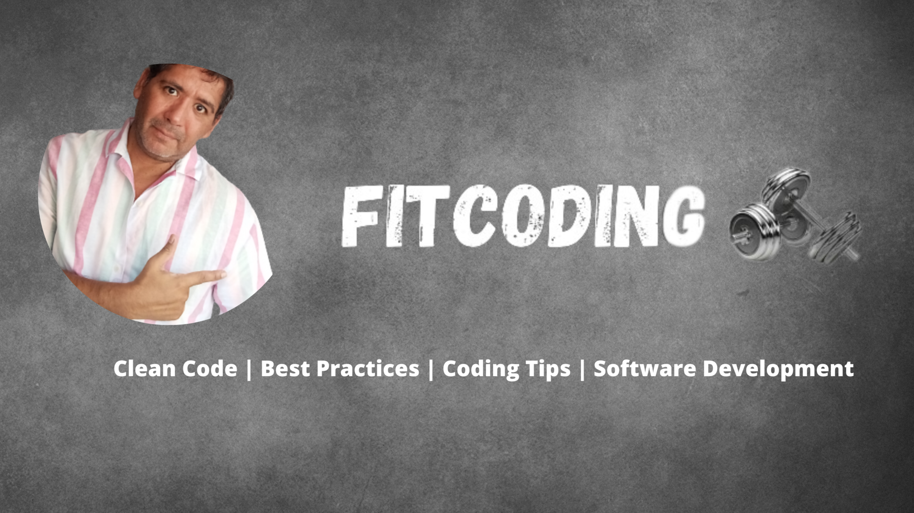

# Bilingual README / README Bilingüe

**This repository is bilingual. Below you will find the English version followed by the Spanish version.  
Este repositorio es bilingüe. A continuación encontrarás la versión en inglés seguida de la versión en español.**

---

<div style="display: block; text-align: center;">


  <div style="max-width: 70%; text-align: left;">
    <strong style="font-size: 30px; font-weight: bold;">Proyecto "RabbitMQ - Domain Event"</strong>
    <br>
    <span style="font-size: 24px;">Software Development with Symfony 7, PHP 8.3, RabbitMQ latest, and Hexagonal Architecture</span>
    <br>
    <span style="font-size: 24px;">Desarrollo de Software con Symfony 7, PHP 8.3, RabbitMQ latest y Arquitectura Hexagonal</span>
  </div>
</div>
<p></p>

## English

# Symfony Project with RabbitMQ in Hexagonal Architecture

This project implements a **messaging system** with **RabbitMQ** in a **Symfony** environment, following **Hexagonal Architecture** and using **domain events** to **decouple** the **business logic** from the **infrastructure**. Domain events are triggered at the core of the application when significant changes occur and are processed by specific **handlers**, allowing, for example, counters or other processes to be updated **asynchronously**.

### Module Message

Additionally, the **Message** module sends messages directly without domain events.

### Module User

Whereas the **User** module uses domain events. For example, when a user registers, a **UserRegisteredEvent** is triggered to update the gender count. After this event is processed, a **UserEmailSentEvent** is dispatched to confirm the user's registration via email.

#### What Happens When a User is Registered?

1. The user is created in the application.
2. A domain event (**UserRegisteredEvent**) is triggered to update the gender count.
3. The event is sent to RabbitMQ via Symfony Messenger.
4. A specific **handler** (**UserRegisteredEventHandler**) processes the event and updates a counter (using a file, database, etc.).
5. After processing **UserRegisteredEvent**, a new event **UserEmailSentEvent** is triggered to notify the user via email.
6. The **UserEmailSentEvent** is sent to RabbitMQ and processed by the respective handler.
7. Make sure the consumer is running to process the events:

   ```bash
   php bin/console messenger:consume async user_registered user_email_sent -vv
   ```

   _(If all events are routed to the same transport, the worker will consume them and execute the corresponding **handlers**.)_

---

## 🚀 Installation Steps

### 1️⃣ Clone the Repository and Navigate to the Folder

```bash
git clone https://github.com/Luispfa/sf7-rabbitmq-ha.git
cd rabbit-mq
```

### 2️⃣ Start the Services with Docker

```bash
docker-compose up -d --build
```

### 3️⃣ Enter the PHP container:

```bash
docker exec -it sf7_php_ha bash
```

### 4️⃣ Install Symfony Dependencies

```bash
php composer install
```

### 5️⃣ Check if RabbitMQ's port 15672 is open on host sf7_rabbitmq_ha:

```bash
nc -zv sf7_rabbitmq_ha 15672
```

### 6️⃣ Make an HTTP request to the RabbitMQ API for detailed status information:

```bash
curl -u guest:guest http://sf7_rabbitmq_ha:15672/api/overview
```

### 7️⃣ Run the RabbitMQ Consumer

```bash
php bin/console messenger:consume async user_registered user_email_sent -vv
```

### 8️⃣ Run the RabbitMQ Consumer in daemon mode:

```bash
php bin/console messenger:consume async user_registered user_email_sent --daemon
```

### 9️⃣ If you are using Windows, add the following line to your C:\Windows\System32\drivers\etc\hosts file:

```
127.0.0.1 dev.rabbit-mq.com
```

---

## Changes in messenger.yml

The `messenger.yml` configuration file has been updated to define dedicated queues for **UserRegisteredEvent** and **UserEmailSentEvent**. The changes ensure that:

1. **UserRegisteredEvent** is routed to `user_registered_queue`.
2. **UserEmailSentEvent** is routed to `user_email_sent_queue`, but also includes a **dead-letter exchange mechanism** to ensure messages are retried if they fail.
3. A **direct exchange type** is used to facilitate event-based communication.

Updated `messenger.yml` configuration:

```yaml
framework:
  messenger:
    transports:
      async:
        dsn: "%env(MESSENGER_TRANSPORT_DSN)%"
        options:
          exchange:
            name: messages
            type: direct
          queues:
            messages: ~
      user_registered:
        dsn: "%env(MESSENGER_TRANSPORT_DSN)%"
        options:
          exchange:
            name: user_events
            type: direct
          queues:
            user_registered_queue: ~
      user_email_sent:
        dsn: "%env(MESSENGER_TRANSPORT_DSN)%"
        options:
          exchange:
            name: user_events
            type: direct
          queues:
            user_email_sent_queue:
              arguments:
                x-dead-letter-exchange: user_events
                x-dead-letter-routing-key: user_registered_queue

    routing:
      'App\Message\Domain\Message\Message': async
      'App\User\Domain\Event\UserRegisteredEvent': user_registered
      'App\User\Domain\Event\UserEmailSentEvent': user_email_sent
```

---

## Send a Test Message

### Sending a Message to the async Queue

- **Method:** POST
- **URL:** `http://dev.rabbit-mq.com/send-message`
- **Headers:** `Content-Type: application/json`
- **Body (raw JSON):**

```json
{
  "message": "Hello RabbitMQ!"
}
```

### Registering a User and Triggering Events

- **Method:** POST
- **URL:** `http://dev.rabbit-mq.com/register-user`
- **Headers:** `Content-Type: application/json`
- **Body (raw JSON):**

```json
{
  "name": "Juan",
  "lastname": "Flores",
  "gender": "Male",
  "email": "email@email.com"
}
```

---

## 🐇 Access to RabbitMQ

- RabbitMQ is accessible at `http://dev.rabbit-mq.com:15672/` with username **guest** and password **guest**.
- If you are using Windows, add the following line to your C:\Windows\System32\drivers\etc\hosts file:

```
127.0.0.1 dev.rabbit-mq.com
```

---

---

## Español

# Proyecto Symfony con RabbitMQ en Arquitectura Hexagonal

Este proyecto implementa un **sistema de mensajería** con **RabbitMQ** en un entorno **Symfony**, siguiendo la **Arquitectura Hexagonal** y utilizando **eventos de dominio** para **desacoplar** la **lógica de negocio** de la **infraestructura**. Los eventos de dominio se activan en el núcleo de la aplicación cuando ocurren cambios significativos y son procesados por **manejadores** específicos, permitiendo, por ejemplo, actualizar contadores u otros procesos de manera **asíncrona**.

### Módulo Mensaje

Además, el módulo **Mensaje** envía mensajes directamente sin eventos de dominio.

### Módulo Usuario

Mientras que el módulo **Usuario** utiliza eventos de dominio. Por ejemplo, cuando un usuario se registra, se activa un **UserRegisteredEvent** para actualizar el conteo de género. Después de que se procesa este evento, se envía un **UserEmailSentEvent** para confirmar el registro del usuario por correo electrónico.

#### ¿Qué ocurre cuando un usuario se registra?

1. Se crea el usuario en la aplicación.
2. Se dispara un evento de dominio (**UserRegisteredEvent**) para actualizar el conteo de género.
3. El evento se envía a RabbitMQ a través de Symfony Messenger.
4. Un **manejador** específico (**UserRegisteredEventHandler**) procesa el evento y actualiza un contador (mediante un archivo, base de datos, etc.).
5. Después de procesar **UserRegisteredEvent**, se activa un nuevo evento **UserEmailSentEvent** para notificar al usuario por correo electrónico.
6. **UserEmailSentEvent** se envía a RabbitMQ y es procesado por su manejador correspondiente.
7. Asegúrate de que el consumidor esté en ejecución para procesar los eventos:

   ```bash
   php bin/console messenger:consume async user_registered user_email_sent -vv
   ```

   _(Si todos los eventos se enrutan al mismo transporte, el trabajador los consumirá y ejecutará los **manejadores** correspondientes.)_

---

## 🚀 Pasos de Instalación

### 1️⃣ Clonar el Repositorio y Navegar a la Carpeta

```bash
git clone https://github.com/Luispfa/sf7-rabbitmq-ha.git
cd rabbit-mq
```

### 2️⃣ Iniciar los Servicios con Docker

```bash
docker-compose up -d --build
```

### 3️⃣ Ingresar al Contenedor PHP:

```bash
docker exec -it sf7_php_ha bash
```

### 4️⃣ Instalar Dependencias de Symfony

```bash
php composer install
```

### 5️⃣ Verificar si el puerto 15672 de RabbitMQ está abierto en el host sf7_rabbitmq_ha:

```bash
nc -zv sf7_rabbitmq_ha 15672
```

### 6️⃣ Realizar una Petición HTTP a la API de RabbitMQ para obtener información detallada del estado:

```bash
curl -u guest:guest http://sf7_rabbitmq_ha:15672/api/overview
```

### 7️⃣ Ejecutar el Consumidor de RabbitMQ

```bash
php bin/console messenger:consume async user_registered user_email_sent -vv
```

### 8️⃣ Ejecutar el Consumidor de RabbitMQ en Modo Daemon:

```bash
php bin/console messenger:consume async user_registered user_email_sent --daemon
```

### 9️⃣ Si estás en Windows, agrega la siguiente línea a tu archivo C:\Windows\System32\drivers\etc\hosts:

```
127.0.0.1 dev.rabbit-mq.com
```

---

## Cambios en messenger.yml

El archivo de configuración `messenger.yml` ha sido actualizado para definir colas dedicadas para **UserRegisteredEvent** y **UserEmailSentEvent**. Estos cambios garantizan que:

1. **UserRegisteredEvent** se enruta a `user_registered_queue`.
2. **UserEmailSentEvent** se enruta a `user_email_sent_queue`, pero también incluye un **mecanismo de intercambio de mensajes en caso de error (dead-letter exchange)** para asegurar reintentos en caso de fallos.
3. Se usa un **intercambio de tipo directo** para facilitar la comunicación basada en eventos.

Configuración actualizada en `messenger.yml`:

```yaml
framework:
  messenger:
    transports:
      async:
        dsn: "%env(MESSENGER_TRANSPORT_DSN)%"
        options:
          exchange:
            name: messages
            type: direct
          queues:
            messages: ~
      user_registered:
        dsn: "%env(MESSENGER_TRANSPORT_DSN)%"
        options:
          exchange:
            name: user_events
            type: direct
          queues:
            user_registered_queue: ~
      user_email_sent:
        dsn: "%env(MESSENGER_TRANSPORT_DSN)%"
        options:
          exchange:
            name: user_events
            type: direct
          queues:
            user_email_sent_queue:
              arguments:
                x-dead-letter-exchange: user_events
                x-dead-letter-routing-key: user_registered_queue

    routing:
      'App\Message\Domain\Message\Message': async
      'App\User\Domain\Event\UserRegisteredEvent': user_registered
      'App\User\Domain\Event\UserEmailSentEvent': user_email_sent
```

---

## Enviar un Mensaje de Prueba

### Enviando un Mensaje a la Cola async

- **Método:** POST
- **URL:** `http://dev.rabbit-mq.com/send-message`
- **Encabezados:** `Content-Type: application/json`
- **Cuerpo (JSON):**

```json
{
  "message": "¡Hola RabbitMQ!"
}
```

### Registrando un Usuario y Activando Eventos

- **Método:** POST
- **URL:** `http://dev.rabbit-mq.com/register-user`
- **Encabezados:** `Content-Type: application/json`
- **Cuerpo (JSON):**

```json
{
  "name": "Juan",
  "lastname": "Flores",
  "gender": "Male",
  "email": "email@email.com"
}
```

---

## 🐇 Acceso a RabbitMQ

- RabbitMQ es accesible en `http://dev.rabbit-mq.com:15672/` con usuario **guest** y contraseña **guest**.
- Si estás en Windows, agrega la siguiente línea a tu archivo C:\Windows\System32\drivers\etc\hosts:

```
127.0.0.1 dev.rabbit-mq.com
```
